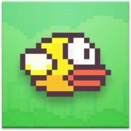

# Flappy Bird Clone

<!-- PROJECT LOGO -->
 

  

<h3 align="center">Flappy Bird Clone</h3>

  

    A python clone of the popular arcade-style game, Flappy Bird!
     
    <a href="https://github.com/djsereno/Flappy-Bird"><strong>Explore the docs »</strong></a>
     
    <a href="https://github.com/djsereno/Flappy-Bird/issues">Report Bug</a>
    ·
    <a href="https://github.com/djsereno/Flappy-Bird/issues">Request Feature</a>
  

<!-- TABLE OF CONTENTS -->

  
Table of Contents

  <ol>
    <li>
      <a href="#about-the-project">About The Project</a>
      <ul>
        <li><a href="#built-with">Built With</a></li>
      </ul>
    </li>
    <li><a href="#installation">Installation</a></li>
    <li><a href="#usage">Usage</a></li>
    <li><a href="#roadmap">Roadmap</a></li>
    <li><a href="#contributing">Contributing</a></li>
    <li><a href="#license">License</a></li>
    <li><a href="#contact">Contact</a></li>
    <li><a href="#acknowledgments">Acknowledgments</a></li>
    <li><a href="#notice">Notice</a></li>
  </ol>

<!-- ABOUT THE PROJECT -->

## About The Project

[![Product Name Screen Shot][product-screenshot]](https://example.com)

Flappy Bird is an arcade-style endless runner game. The player controls a bird by flying through through pairs of pipes that have equally sized gaps placed at random heights. Each successful pass through a pair of pipes awards the player a point. Colliding with a pipe, top of screen, or the ground ends the round!

(<a href="#top">back to top</a>)

### Built With

* [Python](https://www.python.org/)
* [PyGame](https://www.pygame.org/)

(<a href="#top">back to top</a>)

<!-- GETTING STARTED -->

## Installation

1. Download the [Flappy Bird.zip](https://github.com/djsereno/Flappy-Bird/blob/main/Flappy%20Bird.zip) file.
2. Extract the contents to a new folder.
3. Run the `Flappy Bird.exe` file.
    - Note: The `Flappy Bird.exe` file and `assets` folder must be contained within the same folder to work.

(<a href="#top">back to top</a>)

<!-- USAGE EXAMPLES -->

## Usage

Click the `left mouse button` or `space bar` to flap.

Avoid the pipes, ground, and top of screen.

Rinse and repeat. Try to beat your previous high score!  
Scoring: 
- 10 points = Bronze
- 20 points = Silver
- 30 points = Gold
- 40+ points = Platinum

Bonus! At the home screen, click the `right mouse button` to change the bird color, and click the `middle mouse button` to change the time of day.

(<a href="#top">back to top</a>)

<!-- ROADMAP -->

## Roadmap

- [x] Alternate backgrounds and skins
- [ ] Leaderboard implementation
- [ ] UI for SFX/music volume control
- [ ] Window scaling

See the [open issues](https://github.com/djsereno/Flappy-Bird/issues) for a full list of proposed features (and known issues).

(<a href="#top">back to top</a>)

<!-- CONTRIBUTING -->

## Contributing

If you have a suggestion that would make this better, please fork the repo and create a pull request. You can also simply open an issue with the tag "enhancement".
Don't forget to give the project a star! Thanks again!

1. Fork the Project
2. Create your Feature Branch (`git checkout -b feature/AmazingFeature`)
3. Commit your Changes (`git commit -m 'Add some AmazingFeature'`)
4. Push to the Branch (`git push origin feature/AmazingFeature`)
5. Open a Pull Request

(<a href="#top">back to top</a>)

<!-- LICENSE -->

## License

Distributed under the MIT License. See `LICENSE.txt` for more information.

(<a href="#top">back to top</a>)

<!-- CONTACT -->

## Contact

Derek Sereno - [LinkedIn](https://www.linkedin.com/in/dereksereno/) - [Email](mailto:djsereno91@gmail.com)

Project Link: [https://github.com/djsereno/Flappy-Bird](https://github.com/djsereno/Flappy-Bird)

(<a href="#top">back to top</a>)

<!-- ACKNOWLEDGMENTS -->

## Acknowledgments

- Images courtesy of [The VG Resource](https://www.spriters-resource.com/mobile/flappybird/sheet/59894/)
- Audio curtesy of [The VG Resource](https://www.sounds-resource.com/mobile/flappybird/sound/5309/)
- Music curtesy of [Minetrackmania](https://www.youtube.com/watch?v=vLVRmC-q9Oc&ab_channel=DaviddTech)

(<a href="#top">back to top</a>)

## Notice

The Flappy Bird assets and the Flappy Bird name are the work and copyright of original creator Dong Nguyen and .GEARS
games (http://www.dotgears.com/). Their use herein are for non-commercial use only.

I took this Tweet (https://twitter.com/dongatory/status/431060041009856512 / http://i.imgur.com/AcyWyqf.png) by Dong Nguyen, the
creator of the game, as an open invitation to reuse the game concept and assets for use in a personal non-commercial project. There is no intention to
steal the game, or claim the Flappy Bird name as my own.

If the copyright holder would like for the assets to be removed, please open an issue to start the conversation.

<!-- MARKDOWN LINKS & IMAGES -->
<!-- https://www.markdownguide.org/basic-syntax/#reference-style-links -->

[contributors-shield]: https://img.shields.io/github/contributors/djsereno/Flappy-Bird.svg?style=for-the-badge
[contributors-url]: https://github.com/djsereno/Flappy-Bird/graphs/contributors
[forks-shield]: https://img.shields.io/github/forks/djsereno/Flappy-Bird.svg?style=for-the-badge
[forks-url]: https://github.com/djsereno/Flappy-Bird/network/members
[stars-shield]: https://img.shields.io/github/stars/djsereno/Flappy-Bird.svg?style=for-the-badge
[stars-url]: https://github.com/djsereno/Flappy-Bird/stargazers
[issues-shield]: https://img.shields.io/github/issues/djsereno/Flappy-Bird.svg?style=for-the-badge
[issues-url]: https://github.com/djsereno/Flappy-Bird/issues
[license-shield]: https://img.shields.io/github/license/djsereno/Flappy-Bird.svg?style=for-the-badge
[license-url]: https://github.com/djsereno/Flappy-Bird/blob/master/LICENSE.txt
[linkedin-shield]: https://img.shields.io/badge/-LinkedIn-black.svg?style=for-the-badge&logo=linkedin&colorB=555
[linkedin-url]: https://linkedin.com/in/dereksereno
[product-screenshot]: images/screenshot.png
